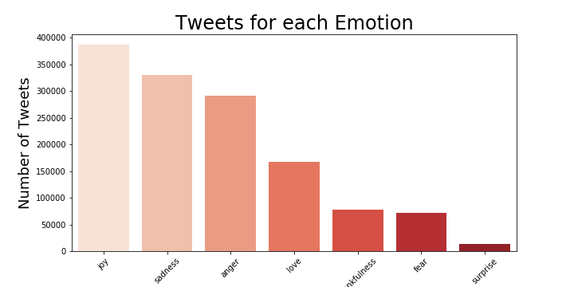
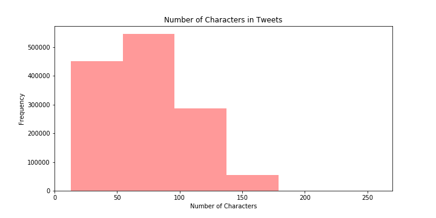
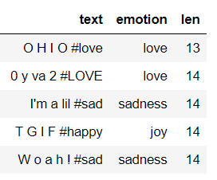
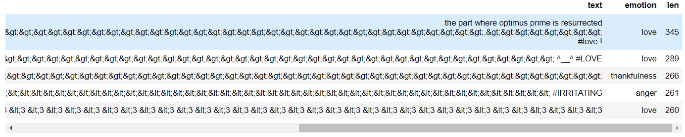
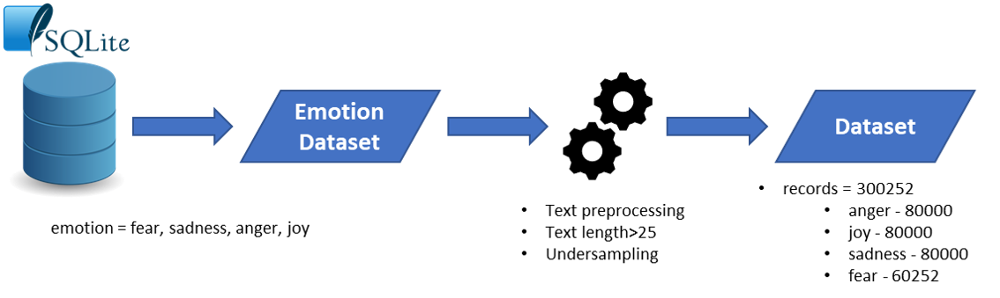
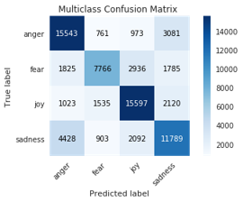

# Emotion Detection on Twitter Posts
by Melissa Rodriguez

## Goal:

Create a Machine Learning Classification Model able to classify emotions from Twitter Posts. Ideally, an emotion detection model can help understand the emotional state of users and help identify trends that could require attention from healthcare providers, and/or close acquaintances.

 __Files:__

- Emotion_Detection_from_Twitter_Posts.pdf

- __Folder__: Jupyter_Notebooks_and_Scripts
    - 01-Twitter_Extract.ipynb
    - 02-Merging_Data.ipynb
    - 03-Data_Analysis_and_Pre-processing.ipynb
    - 04-Classification_with_Keras.ipynb
    - connect_and_create.py
    - extract_twitter_data.py
    - metrics_and_evaluation.py
    - preprocessing.py

## Process:

### 1. Dataset

__jupyter notebooks:__

- 01-Twitter_Extract.ipynb
- 02-Merging_Data.ipynb

- Data was downloaded from: http://knoesis.org/projects/emotion
- Dataset contains tweet id and emotion label
- Tweet texts needs to be downloaded by using the tweet id. - See notebook: 01-Twitter_Extract.ipynb
- __1339794__ records were extracted from Twitter using Tweepy.
    -  For more details about Tweepy refer to: https://tweepy.readthedocs.io/en/latest/
- After noticing that not all records were saved in a csv file, decided to save all merged data into an SQLite Database. - See Notebook: 02-Merging_Data.ipynb

### 2. Exploratory Data Analysis

__jupyter notebook:__
- 03-Data_Analysis_and_Pre-processing.ipynb

__Counts per emotion classes:__

Classes are unbalanced.

__Reviewing text length:__

Text length ranges from 13 to 345 characters.

  Distribution:

  

  Text examples:

  These posts might not have any characters or be useful after preprocessing.

### 3. Preprocessing data

__jupyter notebook:__
- 03-Data_Analysis_and_Pre-processing.ipynb

1. Sub-setting by class: Since my interest is to work with the emotions that could show issues like depression, I decided to subset the data for the following classes:

 - Fear
 - Sadness
 - Anger
 - Joy

2. Preprocessing text:

The following steps were performed to the texts from Twitter Posts:

- Removed usernames
- Removed hashtags (they were used for classification process, this will avoid leakage)
- Transformed emojis: used emoji module to change emojis to words.
    - For more details refer to: https://pypi.org/project/emoji/
- Removed characters repeated more than 2 times
- Removing links to websites
- Removed html characters
- Transformed contractions - replacing words like can't with can not.
    - For more details refer to:https://pypi.org/project/pycontractions/
- Removed numbers
- Removed punctuation
- Set to lowercase
- Lemmatization

3. Sub setting by Text Length

Will subset the data to only those posts where text length is more than 25 characters

4. Undersampling

Since Fear label is the smallest with about 65k records, selected 80k random records for the other three labels.

### 4. Create baseline model, prep data, create, train, and test model

__jupyter notebook:__
- 03-Data_Analysis_and_Pre-processing.ipynb

1. Calculated Baseline Accuracy using Zero Rule Algorithm in order to compare model metrics. The Baseline model predicted that all

Reference: https://machinelearningmastery.com/implement-baseline-machine-learning-algorithms-scratch-python/

2. Applied __text tokenization__ to vectorize the text corpus, by turning each text into a sequence of integers. Then converted the list of sequences into a matrix.

3. Encoded emotion labels so they will become values between 0 and 3 (n_classes -1)

4. Set target (emotion labels) to category type.

5. Split data into train(70%) and test(30%)

6. Created keras sequential model with Dense and Dropout layers

7. Model was compiled and fitted

8. Results:

- Model Accuracy = 63%
- Cohen Kappa Score = 0.50 (moderate agreement)

9. Performance Evaluation:

- Model Accuracy in 35% higher than the baseline(28%).
- Cohen Kappa Score value falls under the “Moderate Agreement” level.
- The model results are good with room for improvement.

Remarks:
24% of sadness class was predicted as anger
20% of fear class was predicted as joy
18% of anger class was predicted as sadness
13% of joy class was predicted as sadness

__References:__

http://knoesis.org/sites/default/files/wenbo_socialcom_2012_0.pdf
