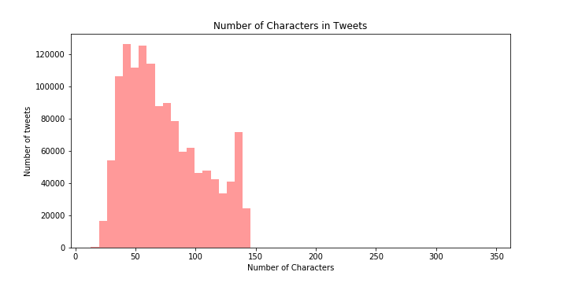

# Emotion Detection on Twitter Posts
by Melissa Rodriguez

## Goal:

Create a Machine Learning Classification Model able to classify emotions from Twitter Posts. Ideally, an emotion detection model can help understand the emotional state of users and help identify trends that could require attention from healthcare providers, and/or close acquaintances.

 __Files:__

- Emotion_Detection_from_Twitter_Posts.pdf

- __Folder__: Jupyter_Notebooks_and_Scripts
    - 01-Twitter_Extract.ipynb
    - 02-Merging_Data.ipynb
    - 03-Data_Analysis_and_Pre-processing.ipynb
    - 04-Classification_with_Keras.ipynb
    - connect_and_create.py
    - extract_twitter_data.py
    - metrics_and_evaluation.py
    - preprocessing.py

## Process:

#### Dataset:

- Data was downloaded from: http://knoesis.org/projects/emotion
- Dataset contains tweet id and emotion label
- Tweet texts needs to be downloaded by using the tweet id. - See notebook: 01-Twitter_Extract.ipynb
- 1339794 records were extracted from Twitter using Tweepy.
    -  For more details about tweepy refer to: https://tweepy.readthedocs.io/en/latest/
- All data was merged and loaded into an SQLite Database. - See Notebook: 02-Merging_Data.ipynb

#### Exploratory Data Analysis

#### Preprocessing data

The following steps were perfomed to the texts from Twitter Posts:

- Removed usernames
- Removed hashtags (they were used for classification process, this will avoid leakage)
- Transformed emojis: used emoji module to change emojis to words.
    -For more details refer to: https://pypi.org/project/emoji/
- Removed characters repeated more than 2 times
- Removing links to websites
- Removed html characters
- Transformed contractions - replacing words like can't with can not.
    - For more details refer to:https://pypi.org/project/pycontractions/
- Removed numbers
- Removed punctuation
- Set to lowercase
- Lemmatization

__Train and Test Model__

__References:__

http://knoesis.org/sites/default/files/wenbo_socialcom_2012_0.pdf
